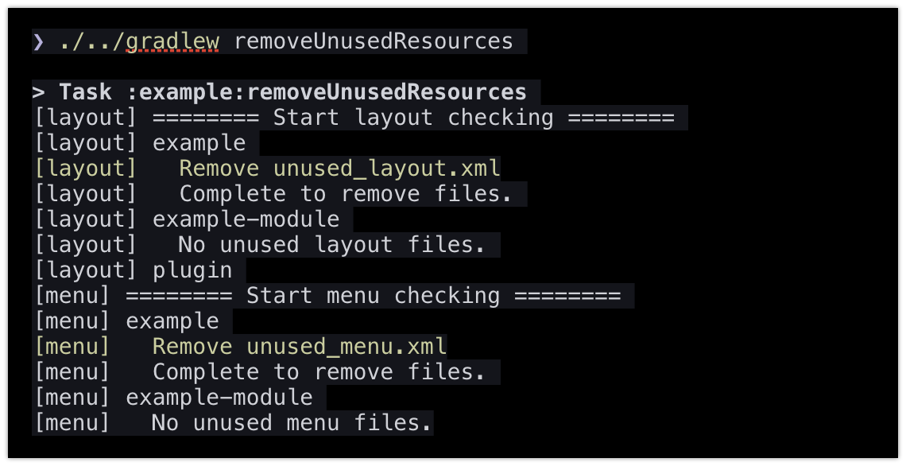

# Unused Resources Remover for Android

[](https://circleci.com/gh/konifar/gradle-unused-resources-remover-plugin)

Gradle Plugin that removes unused resources in Android projects.



# Features
- Easy to remove unused resources by simple gradle command
- Customize extra/exclude files configuration
- Support DataBinding & Multi module project

# Simple usage

### build.gradle

```gradle
buildscript {
  repositories {
    maven { url "https://plugins.gradle.org/m2/" }
  }
  
  dependencies {
    classpath "gradle.plugin.com.github.konifar.gradle:plugin:0.3.3"
  }
}
```

NOTE: If your gradle version is 2.1 and later, you can use new snippet for plugins DSL. 
If you want to know more details, see [plugin](https://plugins.gradle.org/plugin/com.github.konifar.gradle.unused-resources-remover) page.

### app/build.gradle

```gradle
apply plugin: "com.github.konifar.gradle.unused-resources-remover"
```

### Run
 
```shell
$ ./gradlew removeUnusedResources
```

# Advanced usage

This plugin checks some basic resource files below.

```shell
|--res
   |--anim
   |  |--*.xml
   |--animator
   |  |--*.xml
   |--drawable*
   |  |--*.xml
   |  |--*.png
   |  |--*.jpg
   |  |--*.9.png // 9-patch
   |--layout*
   |  |--*.xml
   |--menu
   |  |--*.xml
   |--mipmap*
   |  |--*.xml
   |  |--*.png
   |--values*
      |--attrs*.xml
      |--bools*.xml
      |--colors*.xml
      |--dimens*.xml
      |--floats*.xml
      |--ids*.xml
      |--integers*.xml
      |--strings*.xml
      |--styles*.xml
      |--themes*.xml
```

If you want to check other files, you can add custom remover settings in `app/build.gradle`.

Here is two example.

- `fonts.xml` (actually same format with strings.xml)
- `text_appearance.xml` (actually same format with styles.xml) 

```gradle
unusedResourcesRemover { 
  extraRemovers = [
    createXmlValueRemover("fonts", "string", "string"), // fonts.xml
    createXmlValueRemover("text_appearance", "style", "style", "style") // text_appearance.xml
  ]
  ...
}
```

There are other optional configuration below

```gradle
unusedResourcesRemover {
  ...
  // Write file or directory names
  excludeNames = [
    "strings.xml", // strings.xml is never checked
    "res/drawable" // drawable* dirs are never checked
  ]
  
  // When dryRun option is true, unused files are not removed.
  dryRun = true // default false
}
```

To know more, See [UnusedResourcesRemoverExtension](https://github.com/konifar/gradle-unused-resources-remover-plugin/blob/master/plugin/src/main/groovy/com/github/konifar/gradle/remover/UnusedResourcesRemoverExtension.groovy)

# Contributing
This project is under development.

I'm always welcome your contribution! Feel free to report Issue or send Pull Request!

### Project structure
```
plugin/         - The main module of Gradle plugin
example/        - An example android project that uses this plugin
example-module/ - An example module that are used in example
```

### Download repository
```shell
$ git clone git@github.com:konifar/gradle-unused-resources-remover-plugin.git
$ cd gradle-unused-resources-remover-plugin
```

### Edit build.gradle
```diff
dependencies {
    classpath 'com.android.tools.build:gradle:3.1.2'
    classpath "org.jetbrains.kotlin:kotlin-gradle-plugin:$kotlin_version"

+//    classpath "gradle.plugin.com.github.konifar.gradle:plugin:0.3.3"
-    classpath "gradle.plugin.com.github.konifar.gradle:plugin:0.3.3"
    // For mavenLocal
+    classpath 'com.github.konifar.gradle:unused-resources-remover:0.3.3'
-//    classpath 'com.github.konifar.gradle:unused-resources-remover:0.3.3'
    }
```

### Install to local maven
```shell
$ cd plugin
$ ./../gradlew assemble install
```

### Run example
```shell
$ cd example
$ ./../gradlew removeUnusedResources
...
$ > Task :example:removeUnusedResources 
$ extraRemovers:
$   fileType: font, resourceName: string, type: DEFAULT
$   fileType: text_appearance, resourceName: style, type: STYLE
$ excludeNames:
$   fonts.xml
$ dryRun: false
$ [layout] ======== Start layout checking ========
$ [layout] example
$ [layout]   Remove unused_layout.xml
$ [layout]   Complete to remove files.
$ [layout] example-module
$ [layout]   No unused layout files.
$ [layout] plugin
...
```

# Donation
If this plugin helps you, I would be so happy.

I'm welcome your tip by [Kyash](https://kyash.co/)! My account name is `konifar`. 


# License
```
Copyright 2018 Yusuke Konishi

Licensed under the Apache License, Version 2.0 (the "License");
you may not use this file except in compliance with the License.
You may obtain a copy of the License at

   http://www.apache.org/licenses/LICENSE-2.0

Unless required by applicable law or agreed to in writing, software
distributed under the License is distributed on an "AS IS" BASIS,
WITHOUT WARRANTIES OR CONDITIONS OF ANY KIND, either express or implied.
See the License for the specific language governing permissions and
limitations under the License.
```
